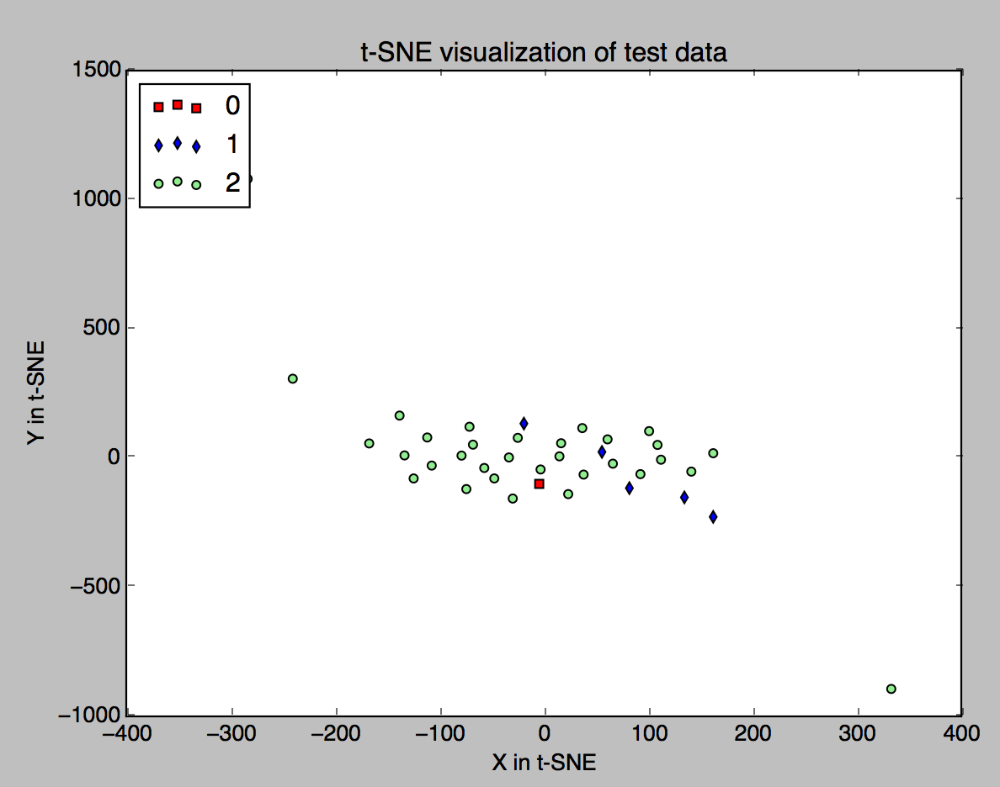
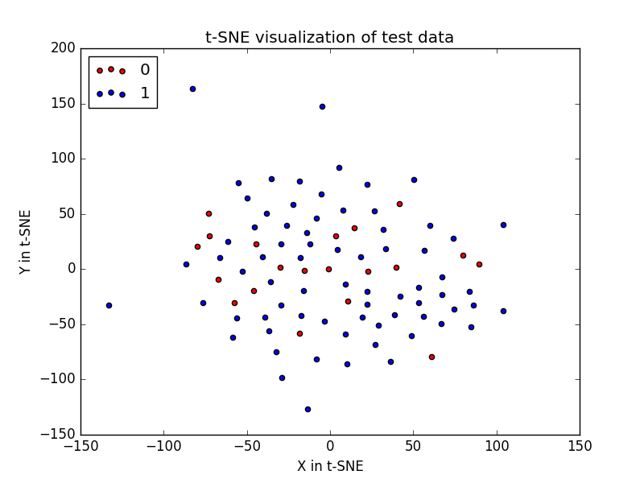

# visualize-GOT
This code attempts to visualise the Game of thrones dataset in kaggle, Particularly [T-SNE Visualization](https://indico.io/blog/visualizing-with-t-sne/)

### Question 1: 
To which class is the NaN of the battles[last\_row][attacker\_outcome_column] is similar to? Win or Lose?

Executing `python visualise_battle.py`, we have this following graph 

So, Mostly it is similar to the **win** outcome.

### Question 2:
How allegiances, nobility and the appearence in the book affect the gender of charecter deaths.

We see some outliers in the death of male charecters.